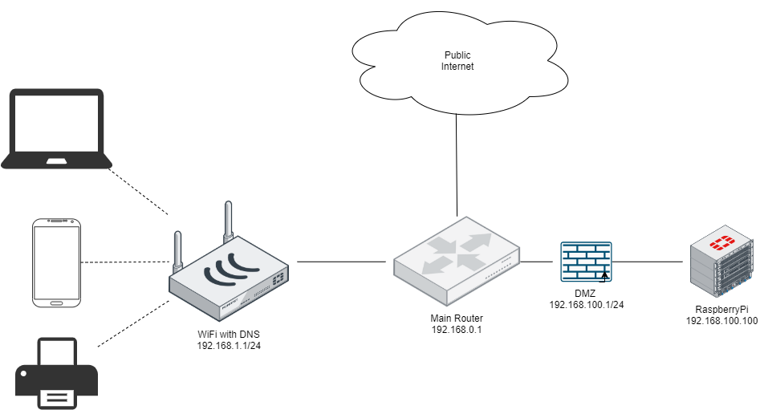

# Introduction

On this repository you can find all the documentation from installation to full config on my Raspberry Pi comand by comand. Most of the resources are external, because I preffer to give credit to the people how created the tutorials.

## Necessity 

I wanted to have a server to be able to **host websites, deploy websites, store files, have access to the servers cli and tunnel connections**. This features must be available to be able to connect from **internet** using a **domain name**.

One of the most important things for this project is to do not have to spend money on software licenses and be open source. The unique cost of this project must be the **Raspberry Pi 3 B+, SD Card 64GB, the electricity and internet connection (200 Mbps)**.

# Raspbian Installation

The distro I use is [Raspbian Lite](https://www.raspberrypi.org/downloads/raspbian/) because I do not need any UI to interact with. The software to burn the image 
in the SD is named [Rufus](https://rufus.ie/) because I am using a Windows OS.

## Raspbian Configuration

If you want a exposed internet server you must conseider some important things depending of how paranoid are you with security, but for me these are fine:
- Delete pi user and create you own one with robust password.
- Use a DMZ [(demilitarized zone)](https://en.wikipedia.org/wiki/DMZ_(computing)) to save you internal network if someone access to you server.
- Open the only necessary ports to access from the internet to you server.

## Current network configuration.

As I mentioned in the last point, its important to have a DMZ wich normally is setting up a firewall (as in my case) to separe the two networks and don't be able to even ping from internal network. The next image ilustre my current network configuration (the image is an example of my current network config): 



## Domain name

As I mentiones in the previous points everything must be free. For this part I found the page [Freenom](https://my.freenom.com/) which I used many times to get free domains with extension **.TK / .ML / .GA / .CF / .GQ**. Is easy only need to register and give some personal data because the domains are register on you name (no credit card needed).

## The router configuration

I chose to open the less ports as it was possible, to do not be so exposed on the internet. The ports are:

- 22 TCP port: to connect using SSH.
- 80 TCP/UDP port: to connect the web server.
- 9898 UDP: for the OpenVPN server.

*The current reason that I am not using HTTPS (443) is because the webs I want to host are not using any authentication or personal information to be secure.

# Server side Software 

- **SSH** to connect to Raspberry PI CLI and send files. 
- **OpenVPN** to create a Virtual Private Network.
- **Apache 2** to host websites.

## Client side software

- [PuTTY](https://www.putty.org/): to connect with SSH on CLI. (Windows)
- [WinSCP](https://www.putty.org/): to connect via SSH on GUI to transfer files easly. (Windows)
- [OpenVPN](https://openvpn.net/): to connect the VPN (Multi platform)

## SSH Configuration

SSH is already installed on Raspberry Pi you only have to activate it. This tutorial gives you the posibility to configure SSH command by command [SSH intro raspberry](https://itsfoss.com/ssh-into-raspberry/).

## OpenVPN Installation 

To install OpenVPN server I decided to follow the tutorial [How to setup and OpenVpn Server on a Raspberry Pi](https://dzone.com/articles/how-to-setup-an-openvpn-server-on-a-raspberry-pi). Which comes with a script to be executed in the Raspberry Pi and information for each screen.

## Apache 2 Installation

To install Apache 2 is quiet easy only execute the command:

```
sudo apt install apache2
```

Obviously in the future you will need some modules when HTTPS or subdomains are used, but for now it works.
